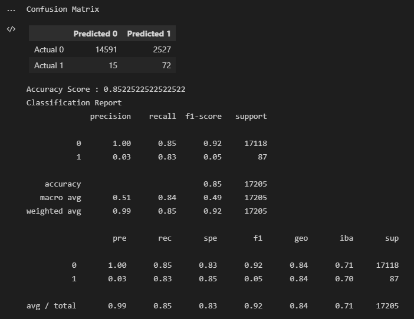

>## *Classification Models - Mortgage Default*  

>## **See PDF markup for script walkthrough** 
#

 

#

>### Overview: 
>> This script will *build* & *evaluate* several machine learning models to predict credit risk based on standard financial services datasets

>> Imbalanced-learn and Scikit-learn libraries will be leveraged for modeling & evaluation utilizing Resampling & Ensemble Learning

 

>## What is Ensemble Learning?
> [According to Medium](https://medium.com/@mygreatlearning/everything-you-need-to-know-about-ensemble-learning-eed79a704a45): It is a powerful method to improve the performance of the model. It combines the predictions from multiple models. The results are improved by using this ML algorithm.

>## What is Resampling?
> [According to Medium](https://medium.com/geekculture/resampling-methods-for-machine-learning-modeling-d2cdc1d3640f): a tool consisting in repeatedly drawing samples from a dataset and calculating statistics and metrics on each of those samples in order to obtain further information about something, in the machine learning setting, this something is the performance of a model. But in case of merely statistical analysis this could be additional insight about the behavior of some parameter.
>

 

# Machine Learning - Classification

# See writeup file (pdf) for support of model results
This assignment utilized binary classification to determine whether loans were high or low risk. 

## Resample - See PDF markup

Three resample methods were used for the resample portion of this assignment to determine *high-risk loans*:
Standard Scaler for oversampling: Balance accuracy: 94%; Precision (0,1): 100%/87%; Recall(0,1): 100%/89%; Specificity(0,1): 89%/100%. 

Over Sampler for oversampling: Balance accuracy: 94%; Precision (0,1): 100%/87%; Recall(0,1): 100%/89%; Specificity(0,1): 89%/100%.

SMOTE for both oversampling and undersampling: Balance accuracy: 99.5%; Precision (0,1): 100%/87%; Recall(0,1): 100%/100%; Specificity(0,1): 100%/100%.

Cluster Centroids for undersampling: Balance accuracy: 99.5%; Precision (0,1): 100%/87%; Recall(0,1): 100%/98%; Specificity(0,1): 98%/100%.

SMOTEENN for both oversampling and undersampling: Balance accuracy: 99.5%; Precision (0,1): 100%/87%; Recall(0,1): 100%/100%; Specificity(0,1): 100%/100%.

## Ensemble
Two ensemble classifiers were used to determine whether loans were high or low risk.

BalancedRandomForestClassifier: Balance accuracy: 88%; Precision (0,1): 100%/3%; Recall(0,1): 88%/72%; Specificity(0,1): 72%/88%.

EasyEnsembleClassifier: Balance accuracy: 85%; Precision (0,1): 100%/3%; Recall(0,1): 85%/83%; Specificity(0,1): 83%/85%.

## Analysis
Resample: All resample methods are effective for the linear regression model, although SMOTEENN outperforms the other resample methods as it produced the linear model with the highest accuracy rate.

Ensemble: Both BalancedRandomForestClassifier & EasyEnsembleClassifier had favoriable results, however the BalancedRandomForestClassifier would be preferred as the classification report produced more favorable results.

## Resources:
1. Northwestern NPS:
https://sps.northwestern.edu/

2. Ensemble Learning (Medium):
https://medium.com/@mygreatlearning/everything-you-need-to-know-about-ensemble-learning-eed79a704a45.
